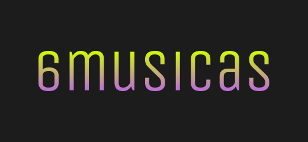

 

    

  <h3 align="center">6MUSICAS</h3>

  

    <a href="https://six-songs.herokuapp.com/">Create now</a>
  

# Introduction

6MUSICAS is a mix-creation app that allows you to search songs via Genius API and create a selection of exactly six songs to share.

# Instructions
This project was bootstraped with create-react-app.

1. Run `npm install` to install dependencies.
2. Run `npm start` to run dev enviroment.

It's necessary to have a Genius API Access Key to send requests.

# Credits
- Song search via [Genius API](https://docs.genius.com/).
- Icons from [Fluent UI](https://fluenticons.co/).